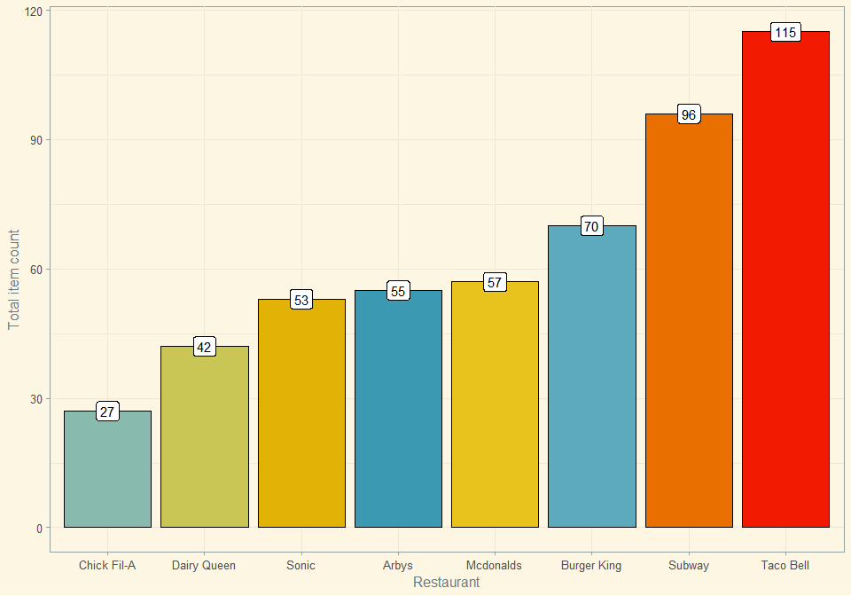
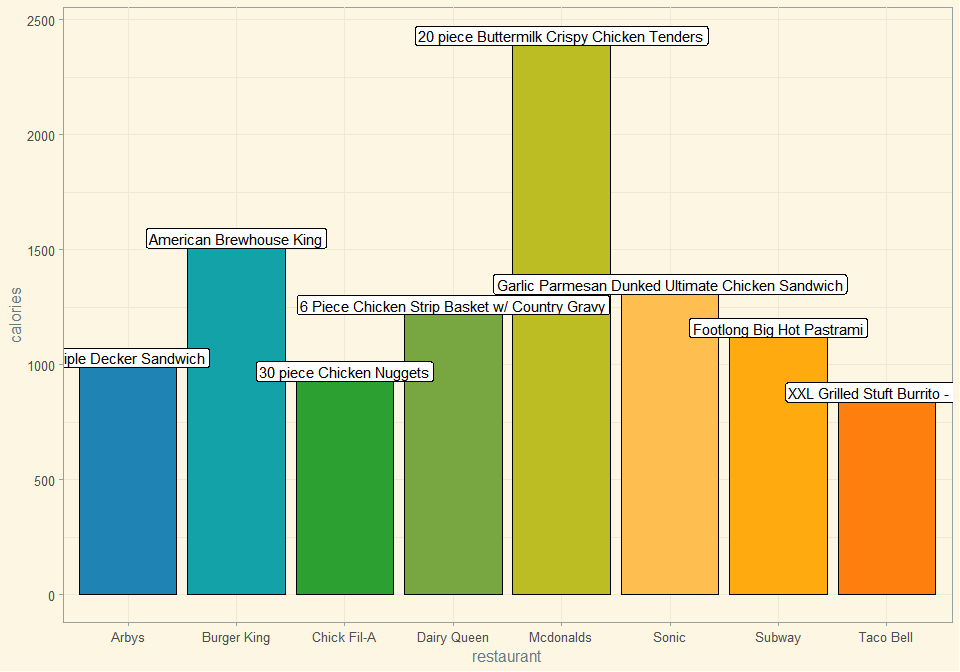
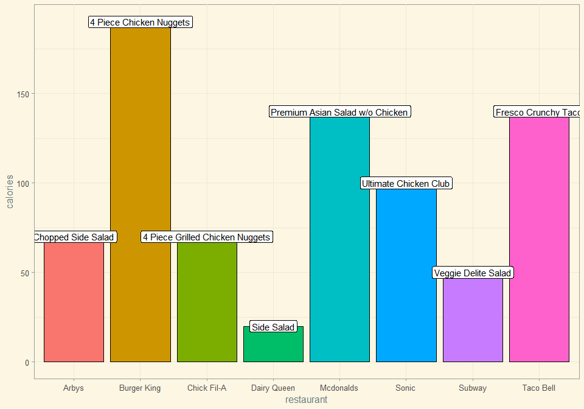
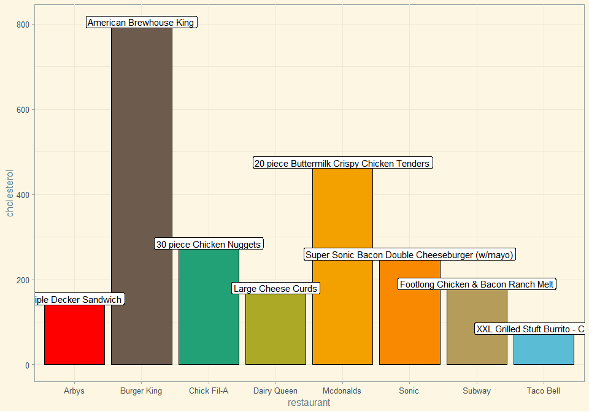
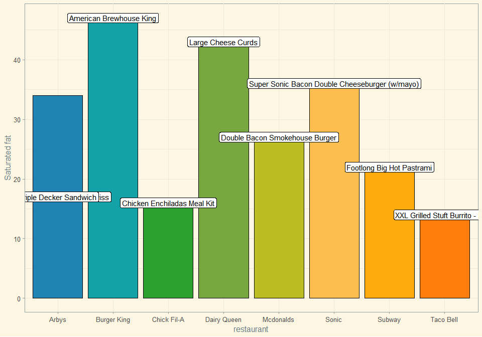
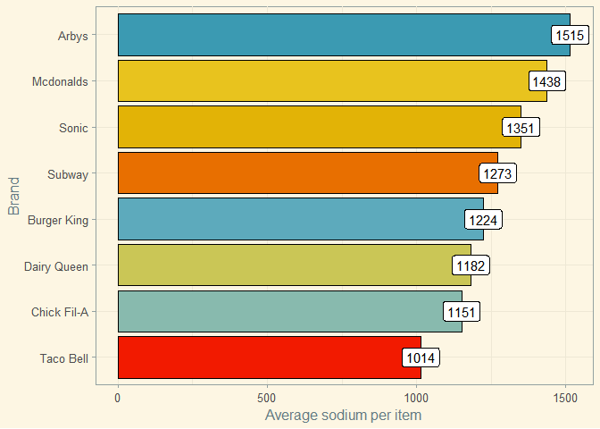
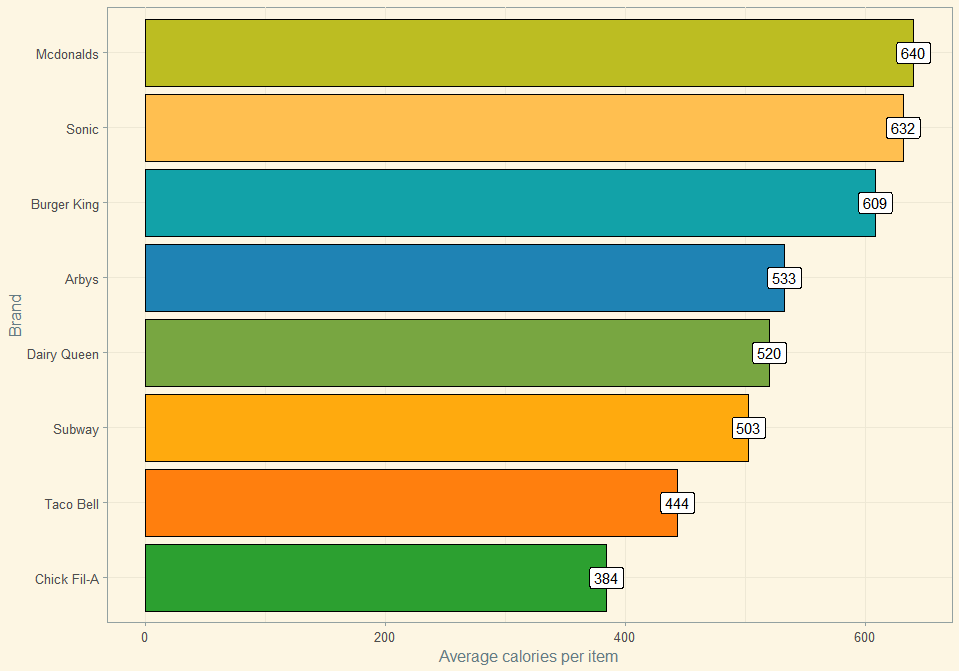
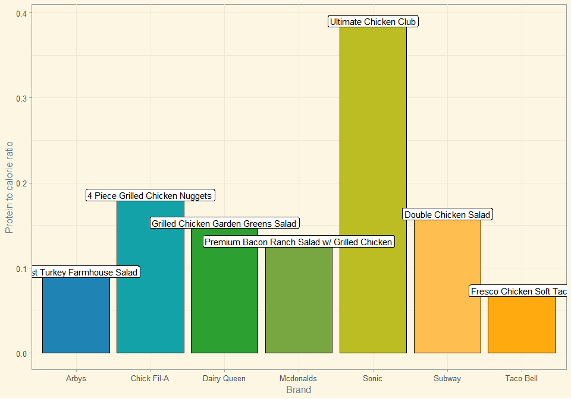

FastFood
================

# Brands by item count:

<!-- -->

# Highest calorie item per brand:

<!-- -->

# Lowest calorie item per brand:

<!-- -->

# Items highest in cholesterol:

<!-- -->

# Items highest in sodium:

<!-- -->

# Average calories per item per brand:

<!-- -->

# Let’s introduce a couple of ratios: protein-to-calories and fiber-to-total-carbs

``` r
fastfood <- fastfood %>% 
  mutate(
    protein_to_calorie = protein/calories,
    fiber_to_carb = fiber/total_carb
  )
```

Foods that offer the most protein per calorie:

<!-- -->

Foods with the highest fiber-to-carbohydrate ratio:

<!-- -->

# A closer look into the brands available (or soon-to-be-available) in Lithuania:

That would be McDonald’s, Subway and Burger King.

# Looking at the McDonald’s highest protein-to-calorie item:

<!-- -->
