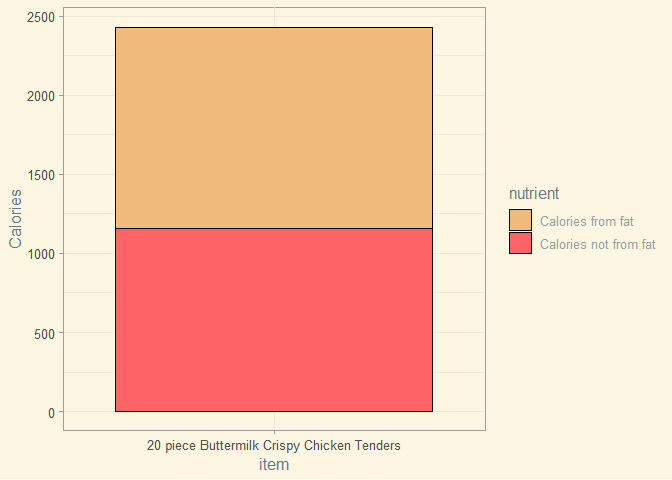
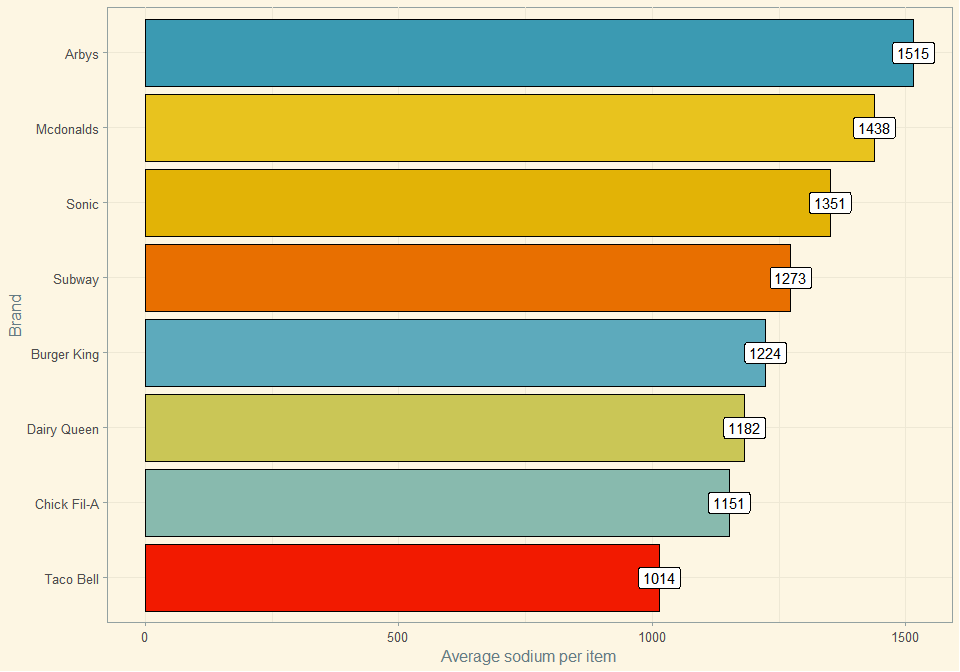
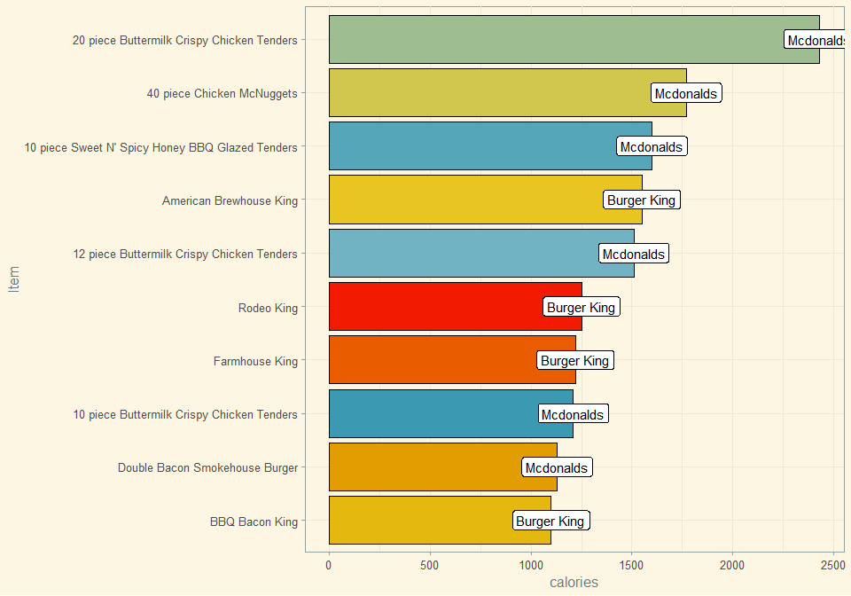
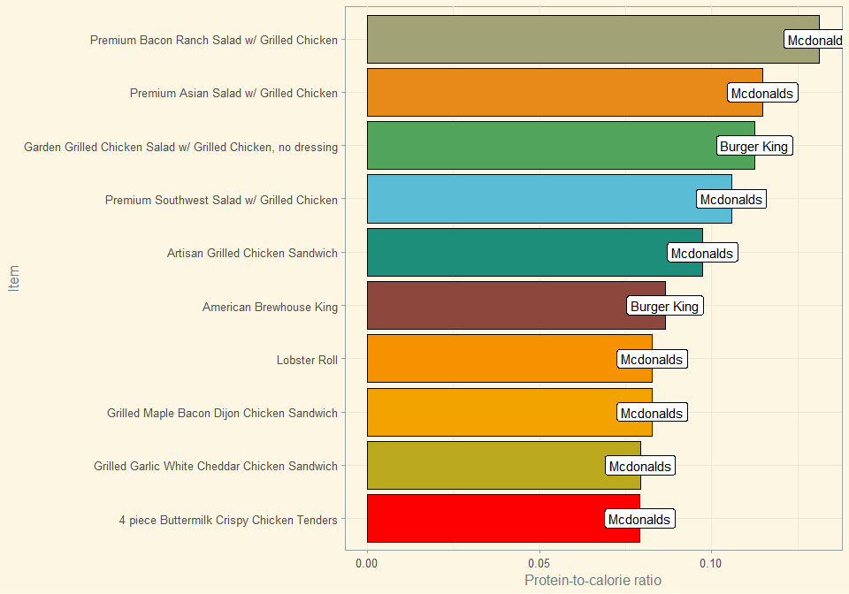

Fast food
================

This was a spontaneous glance at a fast foods data set, taken from
[fastfoodnutrition.org](fastfoodnutrition.org).

# Brands by item count:

Taco Bell appears to offer the highest selection.

In Lithuania, we only have McDonald’s and Subway, with Burger King
coming soon. However, I doubt that the Subway franchises over here
exceed McDonald’s in the items offered.

<!-- -->

# Highest calorie item per brand:

The 20 piece Buttermilk Crispy Chicken Tenders could feed someone for an
entire day. At what cost, though?

<!-- -->

Almost half the calories in this item are from fat.

<!-- -->

# Lowest calorie item per brand:

Would you really go to a fast food chain for a salad?

Chick-Fil-A’s 4 Piece Chicken Nuggets seem to have a questionably low
calorie count - especially when we have a similar alternative from
Burger King for comparison. Maybe it is because they are grilled rather
than fried.

<!-- -->

# Items highest in cholesterol:

The recommended limit used to be 300mg per day or less. However, the
current FDA recommendations no longer include this, as a [review of
studies](https://www.ncbi.nlm.nih.gov/pmc/articles/PMC6024687/) has
pointed out that cholesterol is not linked to cardiovascular disease.

<!-- -->

You know what *is* linked to cardiovascular disease, though?

# Items highest in saturated fat:

Guidelines recommend that people limit the calories from saturated and
trans fats to no more than 10% of their caloric intake.

<!-- -->

# Items highest in sodium:

The American Heart Association recommends [no more than 2,300 milligrams
(mg) a
day](https://www.heart.org/en/healthy-living/healthy-eating/eat-smart/sodium/how-much-sodium-should-i-eat-per-day)
and moving toward an ideal limit of no more than 1,500 mg per day for
most adults.

So, if you want to honor this, you’d better stay away from the following
sodium bombs.

<!-- -->

# Average sodium per item per brand:

Arby’s takes the lead, with McDonald’s coming in second.

<!-- -->

# Average calories per item per brand:

McDonald’s is the winner here. For us Lithuanians, Subway seems like a
somewhat healthier alternative.

<!-- -->

# Let’s introduce a couple of ratios: protein-to-calories and fiber-to-total-carbs

I have always wondered about the first one.

``` r
fastfood <- fastfood %>% 
  mutate(
    protein_to_calorie = protein/calories,
    fiber_to_carb = fiber/total_carb
  )
```

Foods that offer the most protein per calorie:

<!-- -->

Foods with the highest fiber-to-carbohydrate ratio: I had to leave only
some of the brands here due to issues like missing data.

<!-- -->

# McDonald’s vs Burger King: a battle

The top 10 items highest in calories for both brands: McDonald’s takes 6
of these.

<!-- -->

When we look at the top 10 items for both brands ranked by the
protein-to-calorie ratio, McDonald’s takes an obvious lead, claiming
eight of the places.

<!-- -->

What if we looked at protein only, disregarding the calories?

Even if you’re not aiming to maintain a caloric deficit, McDonald’s is
still superior when it comes to offering high-protein items.

<!-- -->

# Looking at the McDonald’s highest protein-to-calorie item:

The Premium Bacon Ranch Salad with Grilled Chicken contains an
impressive ratio of protein.

<!-- -->
